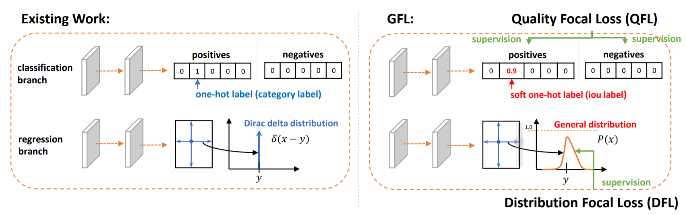

# Detection of Personal-Protective-Equipment (PPE)
## Introduction
A PyTorch implementation of real-time detection of PPE (e.g., hard hat, safety vest) compliances of workers. 
## Problem
According from [the paper](https://www.sciencedirect.com/science/article/abs/pii/S0926580519308325) presents three different approaches for verifying PPE compliance:


**Approach-1**: Model detects worker, hat, and vest (three object classes) individually. Next, ML classifiers (Neural Network, Decision Tree) classify each worker as W (wearing no hat or vest), WH (wearing only hat), WV (wearing only vest), or WHV (wearing both hat and vest).

**Approach-2**: Model localizes workers in the input image and directly classifies each detected worker as W, WH, WV, or WHV.

**Approach-3**: Model first detects all workers in the input image and then, a CNN-based classifier model (VGG-16, ResNet-50, Xception) was applied to the cropped worker images to classify the detected worker as W, WH, WV, or WHV.

## Our implementation
This repository is implemented based-on the **Approach-1**, but instead of using YOLO model we use the end-to-end object detection method introduced in the article: [Generalized Focal Loss: Learning Qualified and Distributed Bounding Boxes for Dense Object Detection](https://arxiv.org/abs/2006.04388).

### Overall impression
The article introduced Generalized Focal Loss improved from the original Focal Loss. A recent trend in one-stage detector is to introduce an individual prediction branch to estimate the quality of localization, e.g., the centerness FCOS or IoU score branch IoUNet can be trained separately and used in NMS process. They have the following problems in existing practices:

**Inconsistent usage of localization quality estimation and classification score between training and inference:** The localization quality estimation and classification score are usually trained independently but compositely utilized (e.g., multiplication) during inference; The supervision of the localization quality estimation is currently assigned for positive samples only, which is unreliable as negatives may get chances to have uncontrollably higher quality predictions. These two factors result in a gap between training and test, and would potentially degrade the detection performance, e.g., negative instances with randomly high-quality scores could rank in front of positive examples with lower quality prediction during NMS.

**Inflexible representation of bounding boxes:** The widely used bounding box representation can be viewed as Dirac delta distribution of the target box coordinates. In fact, the real distribution can be more arbitrary and flexible.

The article proposed new representations for the bounding boxes and their localization quality:

- Merging the localization quality representation with the classification score into a single and unified representation: a classification vector where its value at the ground-truth category index refers to its corresponding localization quality (typically the IoU score between the predicted box and the corresponding ground-truth box).
- Representing the arbitrary distribution for bounding box representation by directly learning the discredited probability distribution over its continuous space.

### Backbone
We use an anchor-free object detection model with a network architecture similar to FCOS:


### Generalized Focal Loss

Generalized Focal Loss (right) is inherited from original Focal Loss (left), however, the current form of Focal Loss only supports {1, 0} discrete labels, but the new labels contain decimals. Therefore, the article proposed to extend the two parts of Focal Loss for enabling the successful training under the case of joint representation:



**Quality Focal Loss (QFL):** Merges classification score and IoU quality to be one `cls-iou` score. The target is dynamically updated online and it is in (0, 1]. For negative samples, the target is 0. So during training, not only the quality of the good predictions get trained with label 1, but the quality of all predicted boxes gets supervision.

**Distributional Focal Loss (DFL):** Directly optimizes a distribution of `bbox` boundaries. The regression target is quantized into `n` (in this repository is 17) bins. The target is expressed as the integral over the distribution. The regression target is actually prepared in the same way as FCOS. In essence, instead of predicting 4 distances (from anchor point to 4 edges of `bbox`), now it predicts `4xn`, distance (bin) distribution instead of direct regression.

## Dataset

We use original data from the article [here](https://drive.google.com/drive/folders/19uUR6EJPQzMeK0YpsxRm51wMZzDmcsv6). Our dataset has the following format:

    .
    ├── images
    |     ├── image_from_china(1).jpg
    |     ├── image_from_china(2).jpg
    |     ├── ...
    └── labels
          ├── image_from_china(1).txt
          ├── image_from_china(2).txt
          ├── ...

Label format: `category x_min y_min x_max y_max`

## Results

| Methods | Backbone | mAP@50 | #param |
| ------- | -------- | ------ | ------ |
|   YOLO  | efficientnet-b0 | _ | _ |
|   FCOS  | efficientnet-b0 | _ | _ |
|    GFL  | efficientnet-b0 | 44.6 | 8.9M |

## Citation

```
@article{Nath2020DeepLF,
  title={Deep learning for site safety: Real-time detection of personal protective equipment},
  author={Nipun D. Nath and Amir H. Behzadan and Stephanie German Paal},
  journal={Automation in Construction},
  year={2020},
  volume={112},
  pages={103085}
}
```

```
@article{Li2020GeneralizedFL,
  title={Generalized Focal Loss: Learning Qualified and Distributed Bounding Boxes for Dense Object Detection},
  author={Xiang Li and Wenhai Wang and Lijun Wu and Shuo Chen and Xiaolin Hu and Jun Li and Jinhui Tang and Jian Yang},
  journal={ArXiv},
  year={2020},
  volume={abs/2006.04388}
}
```
